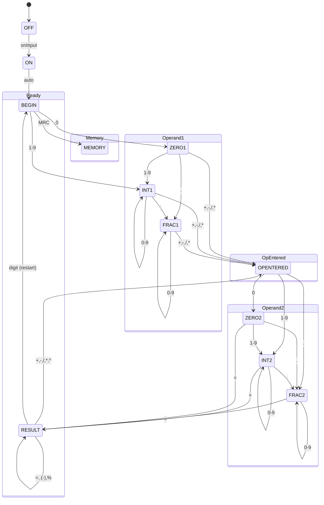

# Calc — Deep Analysis

> **Date:** February 2026
> **Analyzed by:** GitHub Copilot
> **Context:** Retrospective analysis of a Summer 2016 college project (COP 4380, FSU). The calculator implements Figure 2.18 from Miro Samek's *"Practical UML Statecharts in C/C++"* in Java with a JavaFX UI.

---

## State Machine Diagram (as implemented)

---

## Project Scorecard

| Category | Score | Weight | Notes |
|----------|:-----:|:------:|-------|
| **State Machine Design** | 8/10 | 25% | Faithful to Samek's Figure 2.18. Hierarchical states (Ready, Operand1, Operand2) correctly modeled. States for zero/int/frac capture digit-building precisely. |
| **Correctness** | 7/10 | 20% | Core arithmetic works. Chaining operations works. Division-by-zero caught. Percent logic is creative but nonstandard. Exponent only handles integer powers. |
| **Code Quality** | 5/10 | 15% | Everything is `static` — entire SM is global mutable state. No interfaces, no polymorphism. State classes are effectively namespaces for static methods. Duplicated logic between Operand1/Operand2 states. |
| **Test Coverage** | 4/10 | 15% | 8 test cases across 6 files. Only happy-path single-operation tests. No edge cases (division by zero, negation, chained ops, decimal input, memory flow, ON/OFF). Tests use `intValue()` comparisons, losing decimal precision. |
| **UI / UX** | 6/10 | 10% | Clean JavaFX FXML layout with styled buttons, two display fields (operation + result), memory indicator. Absolute positioning limits resizability. No keyboard input. |
| **Architecture** | 5/10 | 10% | Clear separation: `calc` (UI), `statemachine` (logic), `enums` (states). But static coupling means the controller, SM, and states are all tightly wired. No dependency injection or testable abstractions. |
| **Documentation** | 6/10 | 5% | Good Javadoc on math operations. README covers features and build. Debug print toggle is nice. Missing: state transition documentation, design rationale beyond README. |

### Weighted Total: **5.9 / 10**

Solid for a summer course project demonstrating state machine concepts.

---

## What Works Well

1. **Faithful Samek implementation** — The statechart from Figure 2.18 is recognizable. Hierarchical states (BEGIN/RESULT under Ready, ZERO/INT/FRAC under each Operand) correctly model input parsing.
2. **BigDecimal everywhere** — No floating-point precision bugs. Arbitrary precision from day one.
3. **Operand as a composite string builder** — The `negation + zero + int + point + frac + calculated` concatenation model elegantly captures how a user builds a number digit-by-digit.
4. **Operation chaining** — `5 + 3 * 2` correctly evaluates as `(5+3) * 2 = 16` (left-to-right, like a physical calculator).
5. **Memory feature** — M+, M-, MRC with proper state-aware behavior across different operand contexts.
6. **Debug print toggle** — `printOutBool` flag for tracing state transitions is practical.

---

## What Needs Work (Bugs / Design Issues)

| Issue | Severity | Location |
|-------|----------|----------|
| **All static** — CalcSM, all state classes, Operand instances are `public static`. No way to have two calculator instances; impossible to test concurrently. | High | Entire `statemachine/` package |
| **OperandOne/OperandTwo duplication** — `zero1()`, `int1()`, `frac1()` are near-identical copies of `zero2()`, `int2()`, `frac2()`. ~180 lines of duplicated logic. | High | `OperandOneState.java` / `OperandTwoState.java` |
| **ErrorState is dead code** — `error()` sets button value to "error" then immediately matches it. The `default` branch (clear + restart) is unreachable. Error state from enum is never entered via `determineState()`. | Medium | `ErrorState.java` |
| **NEGATED1/NEGATED2 declared but unused** — Enum values exist but `determineState()` has no case for them. Negation is handled inline via `setNegation()`. | Low | `EnumOperationState.java` |
| **`numWithCommas` deprecated + broken** — Groups digits in triplets from the right but starts counting at 2 instead of 3. Never called. | Low | `CalcSM.java` |
| **Tests compare `.intValue()`** — Loses decimal precision. `2.5 == 2` would pass. | Medium | All test files |
| **`MemoryRecall` uses `.ZERO` on instance** — `CalcSM.getMemoryTotal().ZERO` accesses the static `BigDecimal.ZERO` via instance, which works but is misleading. | Low | `MemoryState.java` |
| **Error output check** — `length > 20` is an arbitrary hard-coded limit with no scientific notation fallback. | Low | `CalcSM.java` |

---

## Gap Analysis: Current vs. "Pro Calculator"

| Feature | Current | Pro Calculator | Gap |
|---------|:-------:|:--------------:|:---:|
| Basic arithmetic (+, -, *, /) | Yes | Yes | -- |
| Decimal input | Yes | Yes | -- |
| Negation (+/-) | Yes | Yes | -- |
| Memory (M+, M-, MRC) | Yes | Yes | -- |
| ON/OFF simulation | Yes | -- | -- |
| CE (clear entry) | Yes | Yes | -- |
| Exponent (x^n) | Integer only | Any real power | **Gap** |
| Square root (sqrt) | No | Yes | **Gap** |
| Parentheses / order of operations | No | Yes | **Major Gap** |
| Operation chaining (a + b + c...) | Left-to-right only | With precedence | **Gap** |
| Trig functions (sin, cos, tan) | No | Scientific mode | **Gap** |
| Logarithms (log, ln) | No | Scientific mode | **Gap** |
| Factorial (n!) | No | Scientific mode | **Gap** |
| Constants (pi, e) | No | Scientific mode | **Gap** |
| History / tape | No | Yes | **Gap** |
| Keyboard input | No | Yes | **Gap** |
| Undo / backspace | No | Yes | **Gap** |
| Copy/paste result | No | Yes | **Gap** |
| Responsive / resizable UI | No (absolute layout) | Yes | **Gap** |
| Themes / dark mode | No | Nice-to-have | **Gap** |
| Unit conversion | No | Nice-to-have | **Gap** |
| Error recovery (e.g., after /0) | Partial (display only) | Graceful recovery | **Gap** |
| Expression display (full equation) | Partial | Full expression tree | **Gap** |
| BigDecimal / arbitrary precision | Yes | Yes | -- |
| Concurrent-safe / instance-based | No (all static) | Yes | **Architectural Gap** |
| Test coverage | ~8 happy-path tests | Comprehensive suite | **Major Gap** |

---

## Architecture Maturity Matrix

| Dimension | Student Level | Professional Level | This Project |
|-----------|:------------:|:------------------:|:------------:|
| State pattern | Enum + switch | State interface + polymorphism | Enum + switch |
| Instance model | Static globals | Instance-based, injectable | Static globals |
| Input dispatch | if/else chain on source | Command pattern / event map | if/else chain |
| Math engine | Inline BigDecimal ops | Expression tree / parser | Inline ops |
| Testability | Requires full SM reset | Unit-testable per state | Requires full SM reset |
| UI binding | Manual setText calls | Observable properties / MVVM | Manual setText |
| Error handling | Boolean flag | Exception hierarchy / Result type | Boolean flag |
| Build system | Ant + NetBeans | Gradle/Maven + CI | Ant |

---

## Verdict

For a **summer 2016 college course project** focused on learning UML statecharts from Samek's book, this is a **strong submission**. It demonstrates:

- Understanding of hierarchical state machines
- Correct modeling of a physical calculator's behavior
- Working JavaFX UI
- BigDecimal from the start (most students default to `double`)

The biggest gaps to "pro" level are **architectural** (static everything, duplicated operand states, no expression parser) rather than conceptual. The state machine pattern is correctly understood — it just needs to evolve from a procedural implementation to an object-oriented one. Adding parentheses/precedence would require the most fundamental redesign (moving from a 2-operand state machine to an expression tree or Pratt parser).

---

## Source File Inventory

| File | Lines | Purpose |
|------|------:|---------|
| `CalcSM.java` | 377 | Central state machine — state dispatch, output formatting, debug, getters/setters |
| `Operand.java` | 153 | Digit-by-digit number builder with negation, zero, int, point, frac, calculated parts |
| `OperandOneState.java` | 172 | ZERO1, INT1, FRAC1 input states for first operand |
| `OperandTwoState.java` | 175 | ZERO2, INT2, FRAC2 input states for second operand (mirrors OperandOne) |
| `MathOperationsState.java` | 174 | BigDecimal arithmetic: add, subtract, multiply, divide, exponent, percent, negate |
| `MemoryState.java` | 136 | M+, M-, MRC memory operations across states |
| `OpEnteredState.java` | 92 | Operator selection and dispatch to Operand2 |
| `ReadyState.java` | 109 | BEGIN and RESULT sub-states |
| `ErrorState.java` | 36 | Error handling (partially implemented) |
| `CalcController.java` | 140 | JavaFX FXML controller — button event dispatch |
| `Calc.java` | 38 | JavaFX Application entry point |
| `EnumOperationState.java` | 20 | 18 operational state enum values |
| `EnumMathState.java` | 15 | 8 math operation enum values |
| `FXMLCalcUI.fxml` | 184 | JavaFX UI layout (absolute positioning, 427×595, orange theme) |
| `style.css` | 71 | Button/field styling |
| **Test files (6)** | ~200 | 8 test cases: add(2), subtract(1), multiply(1), divide(1), exponent(2), percent(1) |
| **Total** | **~2,092** | |
